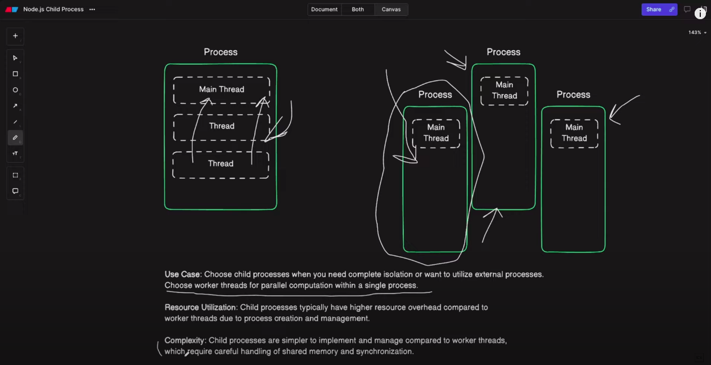

# Child Processes in Nodejs

## Resources

https://blog.stackademic.com/mastering-node-js-child-processes-a-comprehensive-guide-for-developers-4572dafe65c3
https://www.freecodecamp.org/news/node-js-child-processes-everything-you-need-to-know-e69498fe970a/
https://www.youtube.com/watch?v=bbmFvCbVDqo
https://www.youtube.com/watch?v=7cFNTD73N88

https://www.youtube.com/watch?v=C1v4MXGhpcM

https://www.youtube.com/watch?v=uldi59cB7HU

https://www.youtube.com/watch?v=5bXbT_V8Zpc

### spawn(): Running Commands

The spawn() method creates a new process with a specified command and arguments and can capture its output.

### exec(): Running Shell Commands

The exec() method runs a command in a shell and buffers the command’s output. It is suitable for running simple shell commands.

### execFile(): Running Executable Files

The execFile() method allows you to run executable files directly, providing more control and security over command execution.

- Child processes have three standard I/O streams: stdin, stdout, and stderr.
- To interact with child processes, you can listen for events such as data, close, exit, and error, which provide insights into the child process’s status and output.